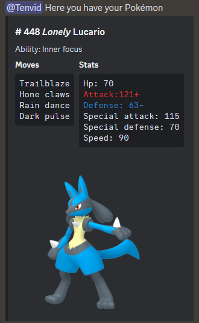

# Frikibot

A Discord bot that generates random Pokémon cards with unique stats using the [PokeAPI](https://pokeapi.co/). Each generated Pokémon is stored in a SQLite database and can be viewed anytime through your personal Pokédex.



## Features

- **Random Pokémon Generation**: Generates a random Pokémon with randomized stats, nature, types, and abilities
- **Shiny Chance**: 10% chance to generate a shiny variant
- **Persistent Storage**: All generated Pokémon are saved to a SQLite database
- **Personal Pokédex**: View all Pokémon you've collected with the `-dex` command
- **Trainer System**: Automatically registers users as trainers on their first Pokémon generation

## Contributing

> See [CONTRIBUTING.md](/CONTRIBUTING.md)

## How to Run

### Prerequisites

- Clone the repository
- Create a Discord bot application at [Discord Developer Portal](https://discord.com/developers/applications)
- Copy your bot token

### Option 1: Direct Python Execution

**Requirements:** Python 3.11 or 3.12

1. Install dependencies:

   ```bash
   pip install -r requirements.txt
   ```

2. Create a `.env` file from the example:

   ```bash
   cp frikibot/.env_example frikibot/.env
   ```

3. Edit `.env` and set your `DISCORD_TOKEN`

4. Run the bot:

   ```bash
   python frikibot/__main__.py
   ```

### Option 2: Docker

**Requirements:** [Docker](https://docs.docker.com/get-started/get-docker/)

1. Build the image:

   ```bash
   docker build -f docker/Dockerfile . -t frikibot:0.1
   ```

2. Run the container:

   ```bash
   docker run --name frikibot \
     -e DATABASE=pokemon.db \
     -e TRAINER_TABLE=trainer \
     -e POKEMON_TABLE=pokemon \
     -e DISCORD_TOKEN=<YOUR-TOKEN> \
     frikibot:0.1
   ```

### Option 3: Docker Compose

1. Create a `.env` file from the example:

   ```bash
   cp frikibot/.env_example frikibot/.env
   ```

2. Edit `.env` and set your `DISCORD_TOKEN`

3. Start the service:

   ```bash
   docker compose -f docker/docker-compose.yml --env-file frikibot/.env up
   ```

## Commands

| Command   | Description                          |
|-----------|--------------------------------------|
| `-pokemon`| Generates a random Pokémon card      |
| `-dex`    | Lists all Pokémon in your collection |

## Project Structure

```
frikibot/
├── controller/          # Command handlers and external API integration
│   ├── discord_controller.py    # Discord bot command routing
│   └── pokeapi_controller.py    # PokeAPI HTTP client
├── domain/              # Repository interfaces (ports)
│   ├── pokemon_repository.py
│   └── trainer_repository.py
├── entities/            # Domain entities
│   ├── pokemon.py       # Pokémon aggregate
│   ├── stats.py         # Battle stats with nature modifiers
│   ├── nature.py        # Nature entity (stat modifiers)
│   └── variety.py      # Pokémon variety data
├── infrastructure/      # External implementations (adapters)
│   ├── database.py              # SQLAlchemy session management
│   ├── sqlalchemy_pokemon_repository.py
│   ├── sqlalchemy_trainer_repository.py
│   └── paginated_view.py        # Discord embed pagination
├── usecases/            # Application business logic
│   ├── generate_pokemon_usecase.py
│   ├── generate_embed_usecase.py
│   └── generate_message_usecase.py
├── shared/              # Shared utilities and constants
├── db/                  # SQLAlchemy ORM models
├── __main__.py          # Application entry point
└── pokemon_generator.py # Pokémon generation orchestration

db/                      # SQLite database storage
docker/                  # Docker and Docker Compose configuration
alembic/                 # Database migrations
tests/                   # Unit and integration tests
```

### Architecture

The project follows **Clean Architecture** principles with clear separation of concerns:

- **Entities**: Core business objects (Pokémon, Stats, Nature)
- **Domain**: Repository interfaces defining data access contracts
- **Use Cases**: Application-specific business rules
- **Infrastructure**: External concerns (database, Discord API, PokeAPI)
- **Controller**: Entry points for Discord commands

## License

See [LICENSE](LICENSE)
